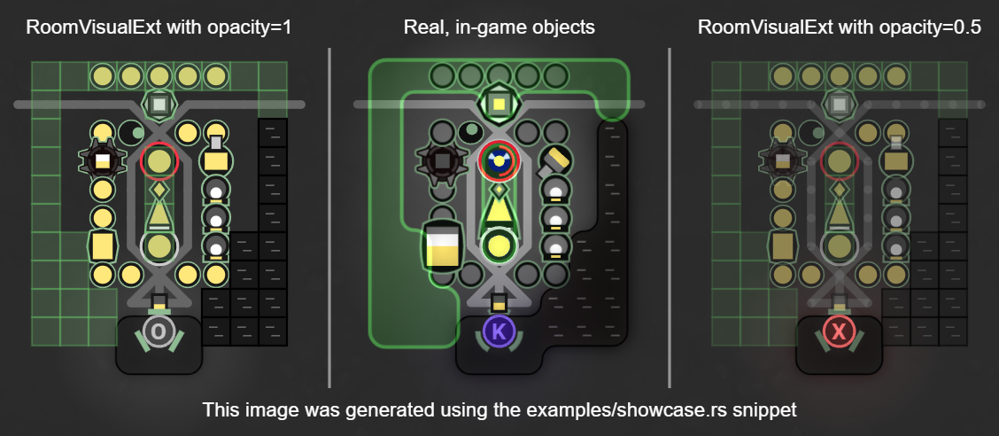

# room_visual_ext

This is an implementation of additional visualization utilities for [Screeps: World](https://screeps.com)
written in Rust for [Rust bots](https://github.com/rustyscreeps/screeps-game-api).

## Installation

Add a dependency in our `Cargo.toml`:
```
[dependencies]
room_visual_ext = "0.1.0"
```

You may also copy the `src/lib.rs` file into your project directly (probably renamed) and either use
it as-is or with your modifications.

## Usage

1. Create a `RoomVisualExt` object much like a `RoomVisual` object:
```rust
use room_visual_ext::RoomVisualExt;
// room_name: RoomName
let room_visual_ext = RoomVisualExt::new(room_name);
```
2. Use its `structure` method to draw structures of given type at given coordinates and with given opacity.
Use opacity 1.0 for opaque visualization and a smaller, positive value for partially transparent.
Small visual artifacts will appear in partially transparent visualizations. 
```rust
room_visual_ext.structure(42.0, 42.0, StructureType::Spawn, 1.0);
room_visual_ext.structure_roomxy(
    unsafe { RoomXY::unchecked_new(42u8, 42u8) },
    StructureType::Rampart,
    1.0
);
```
3. You may also call any `RoomVisual` method directly from the `RoomVisualExt` object.
4. You may not use the object in the next game tick since it becomes invalid just like `RoomVisual`.
5. The roads automatically get connected as you place them.
For results like in the game, place roads before containers that are on them and ramparts after structures below them.

## Example

Below is an example showcasing visualization of all supported structures at opacities 1.0 and 0.5.
For comparison, we present how they look in the actual game.



You may find the code used to produce these visualizations in the `examples/showcase.rs` file.

## Project history

Originally, a JS version of these visualizations was published on Screeps Slack and maintained by different people
(without any particular license).
Nowadays, it may be found in the [screepers repo](https://github.com/screepers/RoomVisual).
Most of the values for colors and shapes of structures come from screepers' RoomVisual.

However, this version has some notable changes:
* implemented extractor,
* square constructed walls and ramparts to improve the visibility,
* transparent ramparts (50% of the base opacity) to enable seeing what is below,
* structures filled with energy/minerals to make it look like structures from an active room,
* smaller terminal and nuker to improve visibility (in line with how the storage in screepers'
  RoomVisual is smaller),
* on-the-fly connection of roads,
* various visual fixes to make it look closer to the original,
* no animated positions, speech bubbles or resource badges.